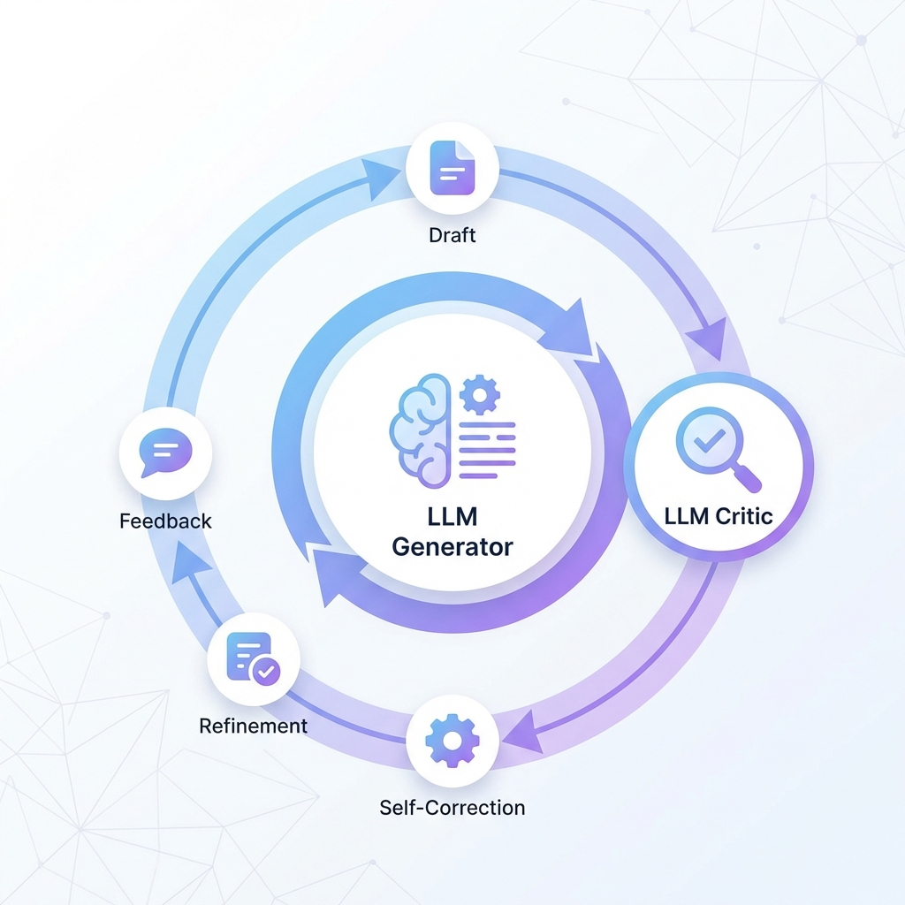

Après avoir vu [qu'est-ce qu'un agent](/fr/translations/what-is-an-agent/), passons aux **patterns agentiques** popularisés par Andrew Ng. Dans cette série, nous implémentons chaque pattern **de zéro**, en Python pur avec des LLM comme Groq, sans frameworks (pas de LlamaIndex ou CrewAI pour l'instant).

Pourquoi ? Pour bien comprendre ce qui se passe sous le capot. On commence par le **pattern de réflexion**, le plus simple, mais qui apporte des gains de qualité surprenants.



## Le pattern de réflexion en bref

Le **pattern de réflexion** permet à un agent d'évaluer sa propre production et de l'améliorer itérativement. L'idée : générer une réponse, la critiquer, l'ajuster, et recommencer.

C'est une **boucle simple** en 4 étapes :  
1. **Génération** : Le LLM produit une première version.  
2. **Réflexion** : Le LLM critique cette version (erreurs, améliorations possibles).  
3. **Correction** : Le LLM intègre les critiques pour raffiner la sortie.  
4. **Répétition** : Retour à l'étape 1  

**Quand arrêter la boucle ?**  
- Après un **nombre fixe d'itérations** (ex. : 3 tours).  
- Quand le LLM génère un **signal d'arrêt** (ex. : "OK", "Parfait", "Final").  

Malgré sa simplicité, ce pattern booste la qualité des réponses, surtout pour du code, des analyses ou des textes complexes.


## Implémentation de zéro : la boucle de réflexion

Testons sur un cas concret : demander à **Llama3 70B** (via Groq) d'implémenter l'algorithme **Merge Sort** en Python.


### Étape 1 : Génération initiale

On initialise un client Groq et un historique de chat avec un prompt système : "Tu es un programmeur Python qui accepte les feedbacks."

Prompt utilisateur : "Implémente Merge Sort en Python."

Résultat typique (version 1) :
```python
def merge_sort(arr):
    if len(arr) <= 1:
        return arr
    mid = len(arr) // 2
    left = merge_sort(arr[:mid])
    right = merge_sort(arr[mid:])
    return merge(left, right)

def merge(left, right):
    result = []
    i, j = 0, 0
    while i < len(left) and j < len(right):
        if left[i] <= right[j]:
            result.append(left[i])
            i += 1
        else:
            result.append(right[j])
            j += 1
    result.extend(left[i:])
    result.extend(right[j:])
    return result
```

Fonctionnel, mais perfectible (pas de docstrings complètes, gestion d'erreurs, etc.).


### Étape 2 : Phase de réflexion

Nouveau prompt système : "Tu es un expert comme Andrej Karpathy. Critique ce code Python : erreurs, style, améliorations, tests."

On passe le code généré comme message utilisateur.

Critiques typiques :  
- Ajouter des **type hints** (PEP 484).  
- Améliorer les **noms de variables** (left → left_half).  
- Ajouter **docstrings détaillées** et **gestion d'erreurs**.  
- Inclure **tests unitaires**.  


### Étape 3 : Intégration et nouvelle génération

On ajoute les critiques à l'historique de génération. Le LLM produit une version 2 : classe orientée objet, tests unittest, edge cases gérés.

La boucle continue jusqu'au critère d'arrêt. Résultat final : un code production-ready avec classe, tests complets (vides, doublons, négatifs), complexité indiquée.

[**Le repo GitHub**](https://github.com/neural-maze/agentic_patterns/blob/main/src/agentic_patterns/reflection_pattern/reflection_agent.py) de la série contient une classe `ReflectionAgent` qui encapsule tout ça proprement.


## L'agent de réflexion en action

Installation : `pip install agentic-patterns` (lib perso pour la série).

Usage simple :
```python
agent = ReflectionAgent(model="llama3-70b")
response = agent.run("Implémente Merge Sort avec tests")
print(response.final_output)
```

Sortie finale : un module complet `MergeSort` avec `__init__`, `_merge` privé, tests exhaustifs. **Amélioration massive** en quelques itérations !


## Pourquoi ça marche si bien ?

- **Auto-correction** : L'agent simule un pair-review infini.
- **Spécialisation** : Un prompt pour générer, un autre pour critiquer.
- **Itératif** : Chaque tour affine, comme un humain qui révise.

Idéal pour : génération de code, rédaction d'essais, analyses de données, où la première tentative est souvent imparfaite.

## Prochaines étapes

Prochain article : les **outils**, ingrédient clé pour rendre les agents vraiment utiles.

## Ressources
- Article original : [Reflection Pattern](https://theneuralmaze.substack.com/p/reflection-pattern-agents-that-think)
- [Vidéo YouTube](https://www.youtube.com/watch?v=0sAVI8bQdRc)