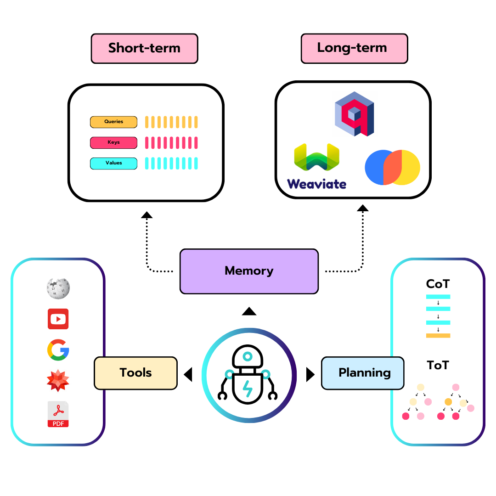
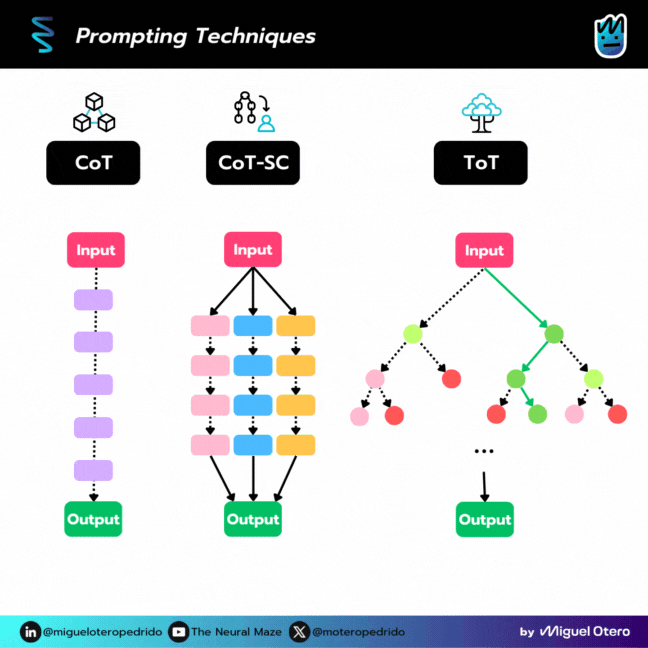
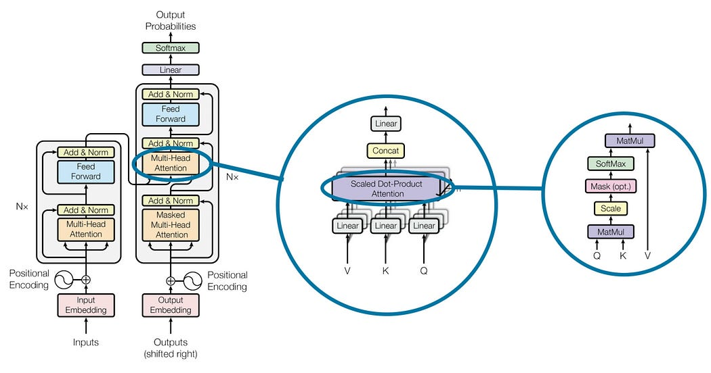
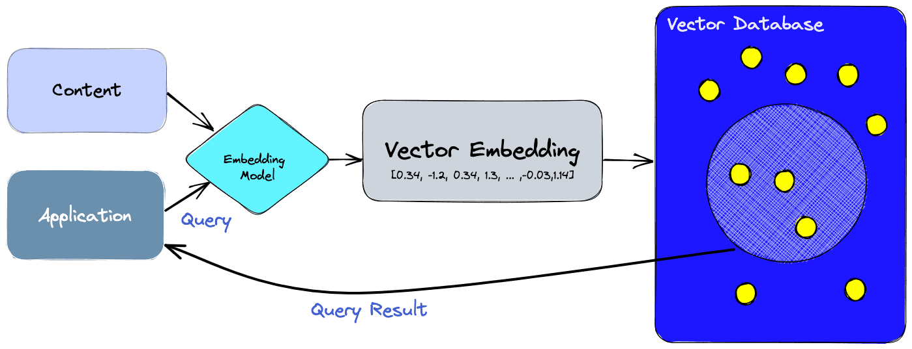

On entend parler **d'agents** partout en ce moment : sur X, dans les newsletters IA, dans les frameworks à la mode… mais quand on gratte un peu, la question de base reste souvent floue : qu'est-ce qu'un agent au juste ?

Dans cette série d'articles, l'idée est de repartir des fondamentaux et de construire une compréhension claire des agents, autant du côté conceptuel que du côté pratique. Ce premier billet pose les bases : un agent, ce n'est pas de la magie, mais un ensemble de briques bien identifiées qui s'appuient sur un modèle de langage.

## Le "cerveau" de l'Agent : le modèle de langage

Au cœur de tout agent moderne, on trouve un grand modèle de langage (LLM). C'est lui qui génère du texte, raisonne, suit des instructions, et sert de **cerveau** au système.

Sans ce modèle :  
- L'agent ne sait ni comprendre les requêtes, ni formuler de réponses.  
- Il ne peut pas planifier, interpréter des résultats, ni s'adapter à son environnement.  
- Toutes les couches "d'intelligence" autour de lui deviennent inutiles.  

On peut voir le LLM comme un cerveau dans un bocal : très puissant, capable d'enchaîner les pensées, mais isolé. Pour qu'il devienne un agent, il faut lui donner des moyens d'agir et de se souvenir.

## Les composants de l'Agent

### Donner des capacités de planification

Un agent n'est pas seulement là pour répondre à une question, il doit être capable de décomposer et d'organiser des tâches plus complexes.

Par planification, on entend :
- Découper un objectif global en sous-tâches.
- Choisir un ordre d'exécution pertinent.
- S'auto-évaluer en cours de route (réfléchir à ses erreurs, ajuster sa stratégie).

Plusieurs techniques de prompting renforcent cette capacité de raisonnement :  
- **[**Chaîne de pensées (Chain of Thought**)](https://arxiv.org/abs/2201.11903)** : l'agent explicite ses étapes de réflexion au lieu de donner directement une réponse.  
- **[**CoT-SC**](https://arxiv.org/abs/2203.11171)** : l'agent essaie plusieurs chemins, puis sélectionne le plus fréquent, permet d'améliore la précision et la fiabilité de la réponse.    
- **[**Arbre de pensées (Tree of Thought**)](https://arxiv.org/abs/2305.10601)** : l'agent explore plusieurs pistes en parallèle, évalue différentes branches et choisit la meilleure.  
- **[**ReAct**](https://arxiv.org/abs/2210.03629)** : permet d'interagir avec des outils externes pour récupérer des informations supplémentaires qui conduisent à des réponses plus fiables et factuelles.  

Même si ces méthodes restent basées sur du texte, elles ajoutent une forme de structure au raisonnement, indispensable pour sortir du simple "chatbot" et tendre vers un agent qui sait gérer des objectifs plus ambitieux.

ReAct est la plus importante technique de planification et nous la couvrirons en détail dans la leçon 3 dédiée au **Planning Pattern**.

### Doter l'Agent d'une mémoire

Pour agir de manière cohérente dans le temps, un agent a besoin de **mémoire**. Sans mémoire, chaque message serait traité comme si le passé n'existait pas.

On distingue généralement deux types de mémoire.

#### Mémoire à court terme

C'est tout ce qui tient dans le contexte immédiat du modèle : l'historique de la conversation, les instructions récentes, les derniers résultats d'outils.  
Concrètement :
- Elle est limitée par la fenêtre de contexte du LLM.
- Elle permet de maintenir le fil d'un échange ou d'une tâche en cours.
- Elle disparaît lorsque le contexte est tronqué ou réinitialisé.

C'est l'équivalent de notre mémoire de travail : ce que l'on garde en tête quelques minutes pour finir une action.

#### Mémoire à long terme

La mémoire à long terme sert à conserver des informations au-delà de la simple fenêtre de contexte, parfois pendant des jours, des semaines ou plus.

Elle est souvent implémentée via :  
- Des bases vectorielles (Qdrant, Weaviate, Pinecone, etc.).  
- Des index de documents ou de connaissances métiers.  
- Des systèmes de "notes" que l'agent peut retrouver par similarité sémantique.  

Grâce à cette mémoire persistante, l'agent peut par exemple :  
- Se rappeler des préférences d'un utilisateur.  
- Réutiliser des connaissances acquises lors de précédents échanges.  
- Accéder à des informations qui ne figurent pas dans les poids du modèle.  

### Les outils : ouvrir l'agent sur le monde

Même avec un bon modèle, du raisonnement et de la mémoire, un agent reste limité tant qu'il ne peut pas interagir avec son environnement. C'est là qu'interviennent les **outils**.

Un outil est, en pratique, une action que l'agent peut déclencher :  
- Interroger une API (météo, bourse, résultats sportifs, etc.).  
- Consulter une base de données ou un moteur de recherche.  
- Créer, modifier ou supprimer des éléments dans un système externe (fichier, ticket, événement calendrier, ligne dans une base SQL, etc.).  

Ces outils permettent à l'agent de :  
- Compléter ce que le modèle ne sait pas (informations trop récentes, trop spécifiques ou volumineuses).  
- Avoir un impact réel sur le monde numérique : automatisation de workflows, intégration dans des pipelines de données, assistants métier, etc.  

L'agent doit donc non seulement savoir *quand* appeler un outil, mais aussi *comment* interpréter sa réponse et l'intégrer dans son raisonnement.

## Récapitulatif : un agent, c'est quoi alors ?

Si on met tout ensemble, un agent moderne repose sur quatre grandes briques :  

- Un **LLM** comme cerveau, pour comprendre et générer du langage.  
- Des **capacités de planification** pour organiser des tâches complexes et ajuster sa stratégie.  
- Une **mémoire** à court et long terme pour garder du contexte et du vécu.  
- Des **outils** pour interagir avec le monde extérieur, lire et modifier des données, appeler des services.  

La combinaison de ces éléments donne naissance à des systèmes qui ne se contentent plus de répondre à des questions, mais qui poursuivent des objectifs, apprennent de l'historique et agissent sur leur environnement.

## Ressources  

- Article original : [What is an agent?](https://theneuralmaze.substack.com/p/what-is-an-agent)

